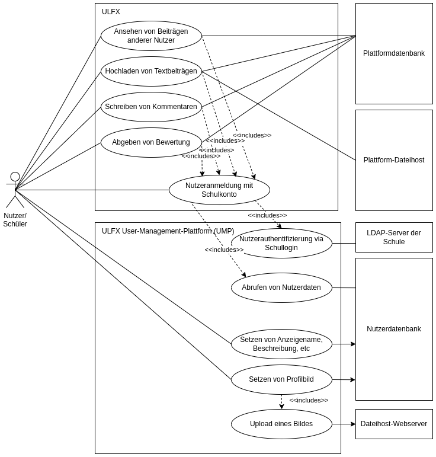

# Beschreibung der Geschäftsprozessszenarien des Kunden
* Analysieren Sie die Vorgaben mit Augenmerk auf mögliche Beteiligte/Systeme (Personen/Objekte)
des Geschäftsprozesses der ITSystemHausDD GmbH.
* Arbeiten Sie verschiedenen Zielplattformen für die Softwareentwicklung heraus und notieren Sie deren Vor-/Nachteile bzw. Besonderheiten.
* Ermitteln Sie Tätigkeiten und Beziehungen der beteiligten Objekte und Personen und stellen Sie diese grafisch in einem Anwendungsfalldiagramm dar. Die möglichen Darstellungsformen entnehmen Sie folgender [Präsenstation](/pdf/anwendungsfalldiagramm.pdf). Als Softwarewerkzeug können Sie Umletino benutzen. Das Programm ist webbasiert und kann über die [Webseite](https://www.umletino.com/umletino.html) gestartet werden. Wählen Sie im DropDown die Auswahl **UML Use Case**.

UML steht für [Unified Modeling Language](uml.md).

## Anwendungsfall des Projektes ULFX

## Anmeldeprozess

## Beitragsanfrage

## Beitrag hochladen

## Profilbild setzen

